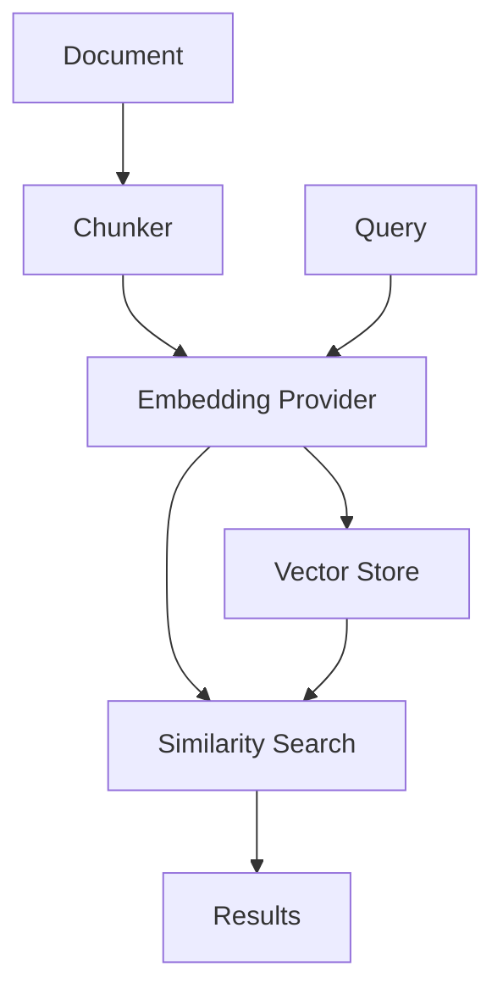

# Core Concepts

This guide explains the fundamental concepts and components of Ragify.js.

## Documents and Chunks

### Documents

A document in Ragify.js is the basic unit of information. It consists of:

```typescript
interface Document {
  text: string;                    // The actual content
  metadata?: Record<string, unknown>; // Optional metadata
}
```

### Chunks

Documents are automatically split into chunks for better processing and retrieval:

```typescript
interface Chunk {
  text: string;                    // The chunk content
  metadata?: Record<string, unknown>; // Inherited from parent document
}
```

The chunking process:
1. Splits text into sentences
2. Preserves sentence boundaries
3. Maintains context through overlap
4. Preserves metadata

## Embeddings

Embeddings are vector representations of text that capture semantic meaning:

### OpenAI Embeddings

Ragify.js uses OpenAI's embedding models:
- `text-embedding-3-small`: 1536 dimensions
- `text-embedding-3-large`: 3072 dimensions
- `text-embedding-ada-002`: 1536 dimensions

```typescript
interface EmbeddingProvider {
  generateEmbeddings: (texts: string[]) => Promise<number[][]>;
  getDimension: () => Promise<number>;
}
```

## Vector Store

The vector store (Qdrant) manages the storage and retrieval of embeddings:

### Features
- Efficient similarity search
- Metadata filtering
- Batch operations
- Scalable storage

### Collection Structure
```typescript
interface CollectionConfig {
  vectors: {
    size: number;      // Embedding dimension
    distance: "Cosine" | "Euclid" | "Dot" | "Manhattan";
  };
}
```

## Querying

### Query Process
1. Convert query text to embedding
2. Search vector store for similar embeddings
3. Return relevant documents with scores

### Query Options
```typescript
interface QueryOptions {
  topK?: number;      // Number of results
  threshold?: number; // Minimum similarity score
}
```

### Result Format
```typescript
interface QueryResult {
  text: string;                    // Document text
  score: number;                   // Similarity score
  metadata?: Record<string, unknown>; // Document metadata
}
```

## Architecture Overview



## Best Practices

1. **Document Size**
   - Keep documents focused and concise
   - Use metadata for organization
   - Consider chunk size for context

2. **Chunking**
   - Adjust chunk size based on content
   - Use overlap for context preservation
   - Consider sentence boundaries

3. **Querying**
   - Use appropriate similarity thresholds
   - Consider result count
   - Leverage metadata filtering

4. **Performance**
   - Batch operations when possible
   - Use appropriate embedding models
   - Monitor vector store size 